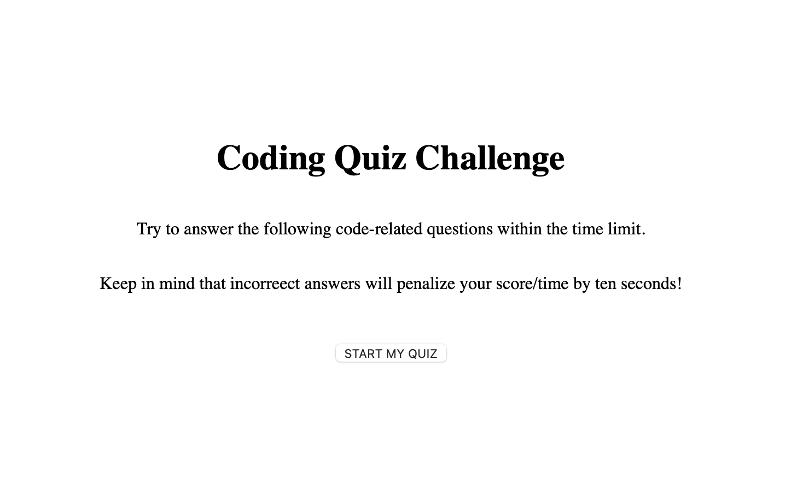

# Quiz

## Description

This page generates a coding quiz challenge for users to test their skills in five timed questions so that they can gage their progress.

## Acceptance Criteria

It is done when...

The user is presented qith a quiz and when they click the start button, they are subsequentially presented with a question.

The timer starts on the first question.

Once the user answers one question, they are presented with another until the quiz is finished.

If the user answers incorrectly, time is subtracted from the clock.

When all questions are answered or the timer reaches 0, the game is over and the user can save their initial score.

## Page

https://dariapressley.github.io/quiz/

## Credits

Eric Sayer (UCLA Tutor) for help with Javascript.

## License

Please refer to the LICENSE in the repo.

